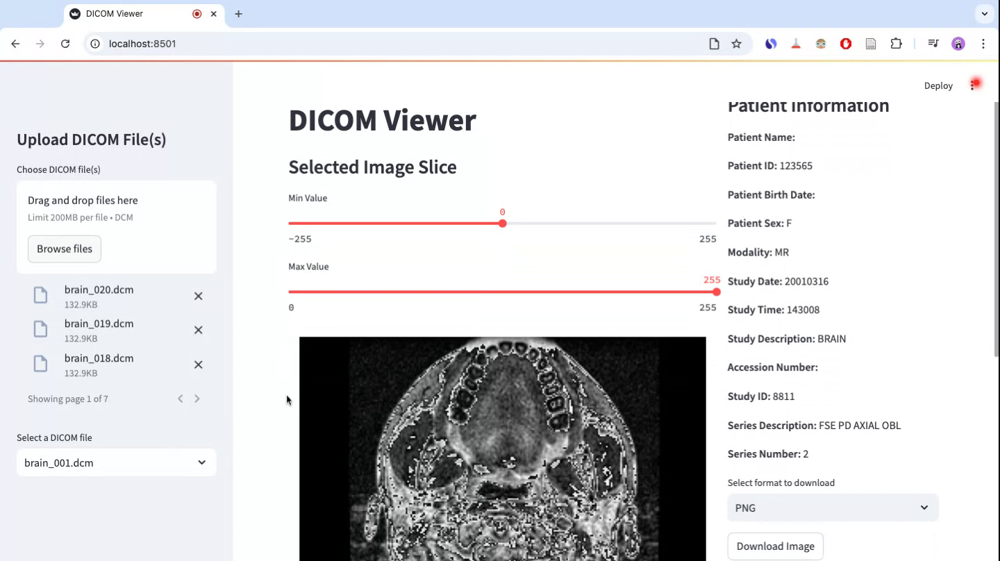
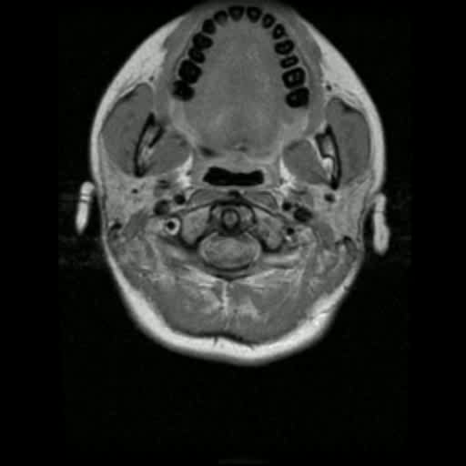
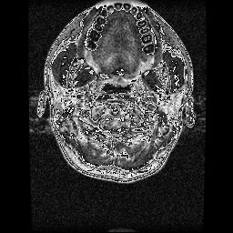
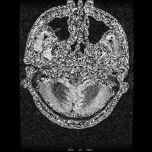
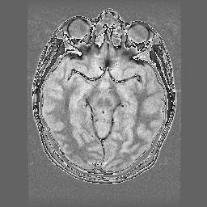
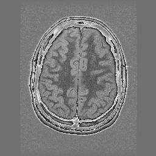

# DICOM Viewer

A simple DICOM file viewer built with Streamlit to upload, view, and process DICOM images. This tool also allows users to generate videos from DICOM slices and download images in multiple formats.


<div style="display: flex; justify-content: space-between;">
  <div style="flex: 1; display: flex; justify-content: center;">
    
  </div> 

  <div style="flex: 1; display: flex; justify-content: center;">
    
  </div>
</div>


<!-- display the giff  within a div
<div style="display: flex; justify-content: center;">
  
</div>  -->

<!-- display 4 images in a 2x2 grid -->
<div style="display: grid; grid-template-columns: repeat(2, 1fr); gap: 10px;">
  
  
  
  
</div>
## Features

- Upload and view multiple DICOM files
- Display DICOM metadata (patient info, study details, etc.)
- Adjust image contrast using min/max sliders
- Generate and download a video from DICOM slices
- Download images in PNG, JPEG, BMP, or TIFF formats

## Installation

To run the DICOM Viewer locally, follow these steps:

### Prerequisites
Ensure you have Python installed (preferably Python 3.8+) and either pip or conda package manager.

### Setting up the Environment

You can set up the environment using either conda or pip:

#### Using Conda (Recommended)
```bash
conda env create -f environment.yml
conda activate dicom
```

### Running the Application

```bash
streamlit run app.py
```

## Usage

1. Upload one or multiple DICOM files via the sidebar.
2. Select a specific file from the dropdown.
3. View metadata and adjust image contrast.
4. Generate a video from the DICOM slices and download it.
5. Download an individual image in your preferred format.

## Dependencies

This application uses the following Python libraries:
- `pydicom` - Read and process DICOM files
- `numpy` - Array operations and image processing
- `streamlit` - Web-based UI for interactive visualization
- `cv2` (OpenCV) - Image processing and video creation
- `matplotlib` - Image visualization
- `PIL` (Pillow) - Image format conversions

## File Structure
```
├── app.py                 # Main Streamlit application
├── utils.py              # Utility functions (e.g., image normalization)
├── environment.yml       # Conda environment configuration
├── README.md             # Documentation
├── Samples             # Contains sample DICOM files
├── Images             # Contain sample exported images and videos


```

## Author

**Yusuf Brima**

🚀 *DICOM Viewer - Built with Streamlit*